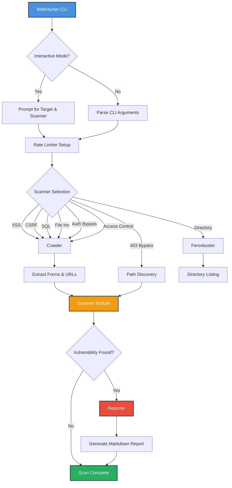
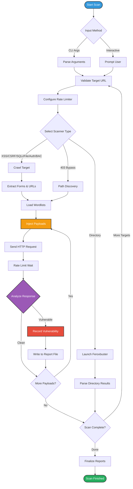

# WebHunter

<p align="center">
  
</p>

WebHunter is a comprehensive command-line web vulnerability scanner designed for ethical hacking and security testing. Written in Rust for performance and safety, it provides an interactive interface for discovering common OWASP Top 10 vulnerabilities in web applications.

## Features

### Vulnerability Scanners

-   **XSS Scanner:** Comprehensive Cross-Site Scripting detection:
    -   **Reflected & Stored:** Fuzzes URL parameters and forms with polyglot payloads
    -   **DOM-based:** Analyzes inline JavaScript for dangerous data flows (14 sources → 18 sinks)
-   **CSRF Scanner:** Detects Cross-Site Request Forgery vulnerabilities by analyzing forms for missing anti-CSRF tokens. Generates HTML Proof-of-Concept (PoC) exploits automatically.
-   **SQL Injection Scanner:** Tests for error-based, boolean-based, and time-based SQL injection in URL parameters and forms.
-   **File Inclusion Scanner:** Detects Local File Inclusion (LFI) and Remote File Inclusion (RFI) vulnerabilities using pattern-based evidence matching.
-   **Authentication Bypass Scanner:** Tests login forms for:
    -   SQL injection bypass (e.g., `' OR '1'='1`)
    -   Default credentials (admin:admin, root:toor, etc.)
-   **Broken Access Control Scanner:** Detects authorization flaws:
    -   **IDOR:** Tests numeric ID manipulation for unauthorized access
    -   **Forced Browsing:** Scans 24 sensitive paths (`/admin`, `/config`, etc.)
    -   **HTTP Method Override:** Tests PUT/DELETE/PATCH on GET endpoints
-   **403/401 Bypass Scanner:** Attempts to bypass access controls using URL manipulation, HTTP method switching, and header injection.
-   **Open Directory Scanner:** Powered by `feroxbuster`, scans for exposed directories and sensitive files using comprehensive wordlists.

### Additional Features

-   **Configurable Rate Limiting:** Control scan speed with adjustable request delays
-   **Multiple Target Scanning:** Scan single URLs or bulk targets from a file
-   **Concurrent Scanning:** Run parallel scans for improved performance
-   **Comprehensive Reporting:** Markdown reports with findings organized by vulnerability type
-   **High Test Coverage:** 62+ unit and integration tests with 100% pass rate

## Architecture Overview



## Workflow

1. **Input:** Target URL(s) provided via CLI or interactive prompt
2. **Crawling:** Discovers pages, forms, and parameters (for applicable scanners)
3. **Payload Injection:** Sends crafted payloads based on scanner type
4. **Analysis:** Examines responses for vulnerability indicators
5. **Reporting:** Generates detailed Markdown reports in target-specific directories

## Scanning Process Flowchart




## Installation

1.  **Install Rust:** If you don't already have Rust installed, use `rustup`:
    ```bash
    curl --proto '=https' --tlsv1.2 -sSf https://sh.rustup.rs | sh
    ```
2.  **Clone the Repository:**
    ```bash
    git clone https://github.com/VenTheZone/Project-WebHunter.git
    cd Project-WebHunter/webhunter
    ```
3.  **Build (Optional):** For better performance:
    ```bash
    cargo build --release
    ```

## Usage

### Interactive Mode

Run without arguments for guided prompts:
```bash
cargo run
# or after building:
./target/release/webhunter
```

### Non-Interactive Mode

Specify target and scanner via CLI:
```bash
# Single target
cargo run -- --target <url> --scanner <type>

# Multiple targets from file
cargo run -- --target-list urls.txt --scanner <type>
```

### Available Scanners

| Scanner | CLI Flag | Description |
|---------|----------|-------------|
| XSS | `xss` | Reflected, Stored, and DOM-based XSS |
| CSRF | `csrf` | Cross-Site Request Forgery |
| SQL Injection | `sql` | Error/Boolean/Time-based SQLi |
| File Inclusion | `file` | LFI and RFI detection |
| Auth Bypass | `auth` | SQLi login bypass + default creds |
| Access Control | `bac` | IDOR, Forced Browsing, Method Override |
| 403/401 Bypass | `bypass` | Access control bypass techniques |
| Directory | `dir` | Open directory and file discovery |

### CLI Options

-   `--target <url>`: Single target URL
-   `--target-list <path>`: File with URLs (one per line)
-   `--scanner <type>`: Scanner to use (see table above)
-   `--wordlist <path>`: Custom wordlist (for directory scanner)

### Rate Limiting

You'll be prompted for request delay (in milliseconds):
-   **Example:** `500ms` = ~2 requests/second
-   **Warning:** RPS > 5 may trigger DoS warnings

### Concurrent Scanning

When using `--target-list`, specify how many targets to scan simultaneously. **Caution:** Multiplies total RPS.

## Testing

WebHunter maintains rigorous code quality standards:

```bash
cargo test
```

-   **Total Tests:** 62 (100% passing)
-   **Coverage:** All scanners, rate limiting, reporting, and core logic
-   **Mocking:** Uses `mockito` for reliable, fast network tests
-   **Test Categories:**
    - Scanner logic tests (payload generation, detection algorithms)
    - Reporter functionality tests (isolated temporary directories)
    - Integration tests (end-to-end scanning workflows)

## Wordlists

Wordlists are located in `webhunter/wordlists/`:

```
wordlists/
├── access_control/
│   └── sensitive_paths.txt      # 24 restricted paths
├── auth_bypass/
│   ├── default_creds.txt        # Common username:password pairs
│   └── sqli_login_bypass.txt    # SQL injection login payloads
├── bypass_403/
│   ├── header_payloads.txt      # Header injection payloads
│   ├── methods.txt              # HTTP methods for bypass
│   └── url_payloads.txt         # URL manipulation payloads
├── file_inclusion/
│   ├── lfi_payloads.txt         # Local file inclusion
│   └── rfi_payloads.txt         # Remote file inclusion
├── sql_injection/
│   ├── boolean_payloads.txt     # Boolean-based SQLi
│   ├── error_payloads.txt       # Error-based SQLi
│   └── time_payloads.txt        # Time-based blind SQLi
└── xss/
    └── payloads.txt             # XSS polyglot payloads
```

You can customize any wordlist to fit your testing needs.

## Output

Reports are saved in directories named after the target (dots → underscores):
- **Example:** `testphp.vulnweb.com` → `testphp_vulnweb_com_443/`

### Generated Reports

| Scanner | Output File | Format |
|---------|-------------|--------|
| XSS | `XSS-output.md` | Markdown |
| DOM XSS | `DOM-XSS-output.md` | Markdown |
| CSRF | `CSRF-output.md` | Markdown + HTML PoCs |
| SQL Injection | `Sql-Injection-output.md` | Markdown |
| File Inclusion | `File-Inclusion-output.txt` | Text |
| Auth Bypass | `auth_bypass_report.md` | Markdown |
| Access Control | `Access-Control-output.md` | Markdown |
| 403 Bypass | `403-Bypass-output.md` | Markdown + Snapshots |
| Directory | `Open-Directories-output.md` | Markdown |

## Project Status

✅ **Priority 1 (Critical OWASP Top 10) - COMPLETE**
- DOM-based XSS Detection
- CSRF Scanner
- Authentication Bypass Testing
- Broken Access Control Tests

🚧 **Priority 2 (Enhanced Detection) - In Roadmap**
- Blind XSS Detection
- Advanced SQL Injection Techniques
- API-Specific Vulnerability Scanning


## Contributing

Contributions are welcome! Please ensure all tests pass before submitting PRs:
```bash
cargo test
cargo clippy
cargo fmt
```

## License

This project is for educational and ethical testing purposes only. Always obtain proper authorization before scanning any web application.

## Disclaimer

**WebHunter is an ethical hacking tool.** Unauthorized scanning of websites you do not own or have explicit permission to test is illegal and unethical. Always obtain written permission before conducting security assessments.
