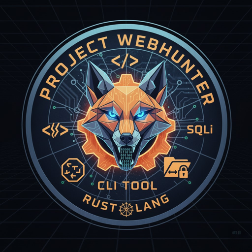

# WebHunter

<div align="center">



[](LICENSE)
[](https://www.rust-lang.org/)
[]()

**A powerful command-line tool for ethical web vulnerability scanning**

</div>

---

## 📋 Table of Contents

- [Overview](#overview)
- [Features](#features)
- [Prerequisites](#prerequisites)
- [Installation](#installation)
- [Usage](#usage)
  - [Rate Limiting](#rate-limiting)
  - [Concurrent Scanning](#concurrent-scanning)
  - [Interactive Mode](#interactive-mode)
  - [Non-Interactive Mode](#non-interactive-mode)
  - [Scanners](#scanners)
  - [Options](#options)
- [Wordlists](#wordlists)
- [Output](#output)
- [Disclaimer](#disclaimer)
- [Contributing](#contributing)
- [License](#license)

## Overview

WebHunter is a command-line tool for ethical hacking, designed to find common vulnerabilities in websites. It is written in Rust and provides a simple, interactive interface for running various scanning modules.

> [!WARNING]
> This tool is intended for **authorized security testing only**. Always obtain written permission before scanning any target. Unauthorized use may be illegal.

## Features

-   **XSS Scanner:** Scans a website for reflected and stored Cross-Site Scripting (XSS) vulnerabilities in both URL parameters and HTML forms.
-   **Open Directory Scanner:** Scans a website for open directories and sensitive files using a comprehensive, built-in wordlist based on SecLists' `raft-large` collections. This scanner is powered by `feroxbuster`.
-   **File Inclusion Scanner:** Scans for Local File Inclusion (LFI) and Remote File Inclusion (RFI) vulnerabilities by injecting a variety of payloads into URL parameters and form inputs.
-   **SQL Injection Scanner:** Scans for error-based, boolean-based, and time-based SQL injection vulnerabilities in both URL parameters and HTML forms.
-   **403/401 Bypass Scanner:** Attempts to bypass `403 Forbidden` and `401 Unauthorized` restrictions on discovered paths using a variety of techniques, including URL manipulation, HTTP method switching, and header injection.
-   **Configurable Rate Limiting:** Set a global request delay to control the scan speed and avoid overwhelming the target server.
-   **Multiple Target Scanning:** Scan a single target or provide a file containing a list of URLs for bulk scanning.
-   **Concurrent Scanning:** Run scans on multiple websites concurrently to improve performance.

## Prerequisites

Before installing WebHunter, ensure you have the following:

-   **Rust 1.70 or higher**: Install from [rustup.rs](https://rustup.rs/)
-   **Git**: For cloning the repository
-   **feroxbuster** (optional): Required only for the Open Directory Scanner. WebHunter can install this automatically when needed.

## Installation

1.  **Install Rust:** If you don't already have Rust installed, you can install it using `rustup`:
    ```bash
    curl --proto '=https' --tlsv1.2 -sSf https://sh.rustup.rs | sh
    ```
2.  **Clone the Repository:**
    ```bash
    git clone https://github.com/VenTheZone/Project-WebHunter.git
    cd Project-WebHunter
    ```


## Usage

You can run WebHunter directly using `cargo run` for a debug build, which is ideal for development and testing.

```
cargo run -- --target <target-url> --scanner <scanner-type>
```

For better performance, you can build a release executable:

```
cargo build --release
```

### Rate Limiting

Before the scan begins, you will be prompted to enter a request delay in milliseconds. This value controls the time between each request sent by the scanners.

-   **Example:** Entering `500` will result in a delay of 500ms between requests, which is approximately 2 requests per second (RPS).
-   **Warning:** If the calculated RPS is greater than 5, a warning will be displayed to caution against potential Denial of Service (DoS) risks.

### Concurrent Scanning

When using the `--target-list` option, you will be prompted to enter the number of websites you would like to scan at a time. This allows you to run scans in parallel for improved performance.

-   **Warning:** Running scans on multiple sites at once will multiply your total requests per second. A high RPS can impact server performance and may be considered a Denial-of-Service (DoS) attack. Please ensure you have permission and proceed with caution.

### Interactive Mode

You can run WebHunter in interactive mode by running it without any arguments:

```
./target/release/webhunter
```

This will present you with a series of prompts to enter the target URL and choose a scanner.

If you select the "Open Directory Scanner" and do not have `feroxbuster` installed, the tool will offer to install it for you.

### Non-Interactive Mode

You can also run WebHunter in non-interactive mode by providing the target URL and scanner type as command-line arguments:

```
# Scan a single target
./target/release/webhunter --target <target-url> --scanner <scanner-type>

# Scan multiple targets from a file
./target/release/webhunter --target-list <path/to/urls.txt> --scanner <scanner-type>
```

### Scanners

-   `xss`: **Cross-Site Scripting Scanner.** This scanner crawls the target website to find all links and forms. It then injects a variety of payloads to test for reflected and stored XSS vulnerabilities.
-   `dir`: **Open Directory Scanner.** This scanner uses `feroxbuster` to search for open directories and sensitive files. It uses a default wordlist, but you can specify a custom one with the `--wordlist` option.
-   `file`: **File Inclusion Scanner.** This scanner tests for Local File Inclusion (LFI) and Remote File Inclusion (RFI) vulnerabilities. It injects payloads into URL parameters and form inputs and looks for specific patterns in the response that indicate a successful inclusion.
-   `sql`: **SQL Injection Scanner.** This scanner tests for error-based, boolean-based, and time-based SQL injection vulnerabilities. It injects payloads into URL parameters and form inputs and analyzes the server's response to detect potential vulnerabilities.
-   `bypass`: **403/401 Bypass Scanner.** This scanner attempts to access forbidden paths by trying various bypass techniques. Upon success, it immediately prints the results to the console and takes a full-page screenshot and an HTML snapshot of the page for evidence.

### Options

-   `--target <url>`: Specifies a single target URL to scan.
-   `--target-list <path>`: Specifies a path to a file containing a list of target URLs, one per line.
-   `--wordlist <path>`: Specifies a custom wordlist to use with the Open Directory scanner. If not provided, a comprehensive default wordlist is used.

## Wordlists

WebHunter uses a variety of wordlists to fuel its scanners. You can customize the behavior of the scanners by modifying these files, which are located in the `wordlists/` directory.

-   `wordlists/user_agents.txt`: A list of User-Agent strings used in various requests.
-   `wordlists/http_headers.txt`: A list of HTTP headers (key-value pairs) used for bypasses and other checks.
-   `wordlists/methods.txt`: A list of HTTP methods (e.g., GET, POST, PUT) to be used in bypass checks.
-   `wordlists/directories.txt`: A list of common directory names to check for.
-   `wordlists/files.txt`: A list of common file names to check for.
-   `wordlists/bypass_403/`: Contains payloads specifically for the 403/401 bypass scanner.
-   `wordlists/file_inclusion/`: Contains payloads for the File Inclusion scanner.
-   `wordlists/sql_injection/`: Contains payloads for the SQL Injection scanner.
-   `wordlists/xss/`: Contains payloads for the XSS scanner.


## Output

All scan reports and evidence are saved in a directory named after the target domain, with dots replaced by underscores. For example, if you scan `http://testphp.vulnweb.com/`, all output will be saved in the `testphp_vulnweb_com` directory.

When using the `--target-list` option, a separate output directory will be created for each target.

The following report files are generated:

-   **XSS Scanner:** `XSS-output.md`
-   **Open Directory Scanner:** `Open-Directories-output.md`
-   **File Inclusion Scanner:** `File-Inclusion-output.txt`
-   **SQL Injection Scanner:** `Sql-Injection-output.md`
-   **403/401 Bypass Scanner:** `403-Bypass-output.md`, along with `HTML` and `PNG` snapshots in the `snapshots/` subdirectory.

## Disclaimer

> [!CAUTION]
> **Legal and Ethical Use Only**

WebHunter is designed exclusively for **authorized security testing** and educational purposes. Users must:

- ✅ Obtain **written permission** before scanning any target
- ✅ Only test systems you own or have explicit authorization to test
- ✅ Comply with all applicable laws and regulations
- ✅ Use responsibly and ethically

**Unauthorized use of this tool may be illegal and could result in criminal prosecution.**

The developers of WebHunter assume no liability and are not responsible for any misuse or damage caused by this tool. Use at your own risk.

### Responsible Disclosure

If you discover vulnerabilities using WebHunter:
1. Report them responsibly to the affected organization
2. Allow reasonable time for remediation before public disclosure
3. Follow coordinated disclosure practices
4. Respect bug bounty program rules and scope

## Troubleshooting

### Common Issues

**Issue: `feroxbuster` not found**
- **Solution**: When running the Open Directory Scanner for the first time, WebHunter will offer to install `feroxbuster` automatically. Accept the prompt or install it manually:
  ```bash
  cargo install feroxbuster
  ```

**Issue: Permission denied errors**
- **Solution**: Ensure you have the necessary permissions to write to the output directory. Try running with appropriate permissions or change the output location.

**Issue: High memory usage during scans**
- **Solution**: Reduce concurrent scanning by lowering the number of simultaneous targets when prompted. Use higher rate limiting delays to reduce request frequency.

**Issue: Connection timeouts**
- **Solution**: The target server may be slow or blocking requests. Increase the rate limiting delay or check if the target is accessible.

**Issue: False positives in scan results**
- **Solution**: Manually verify all findings. Security scanners can produce false positives. Always validate results before reporting.

### Getting Help

- Check the [pseudo-code documentation](pseudo-code/README.md) for detailed algorithm explanations
- Review the [QUICKSTART guide](pseudo-code/QUICKSTART.md) for quick reference
- Open an issue on GitHub for bug reports or feature requests

## Contributing

Contributions are welcome! Please see [CONTRIBUTING.md](CONTRIBUTING.md) for details on:
- Code of conduct
- How to submit bug reports and feature requests
- Development setup and workflow
- Pull request guidelines
- Coding standards

## License

This project is licensed under the **Apache License 2.0** - see the [LICENSE](LICENSE) file for details.

```
Copyright 2025 VenTheZone

Licensed under the Apache License, Version 2.0 (the "License");
you may not use this file except in compliance with the License.
You may obtain a copy of the License at

    http://www.apache.org/licenses/LICENSE-2.0

Unless required by applicable law or agreed to in writing, software
distributed under the License is distributed on an "AS IS" BASIS,
WITHOUT WARRANTIES OR CONDITIONS OF ANY KIND, either express or implied.
See the License for the specific language governing permissions and
limitations under the License.
```

---

<div align="center">

**Made with ❤️ for the security community**

[Report Bug](https://github.com/VenTheZone/Project-WebHunter/issues) · [Request Feature](https://github.com/VenTheZone/Project-WebHunter/issues) · [Documentation](pseudo-code/README.md)

</div>
