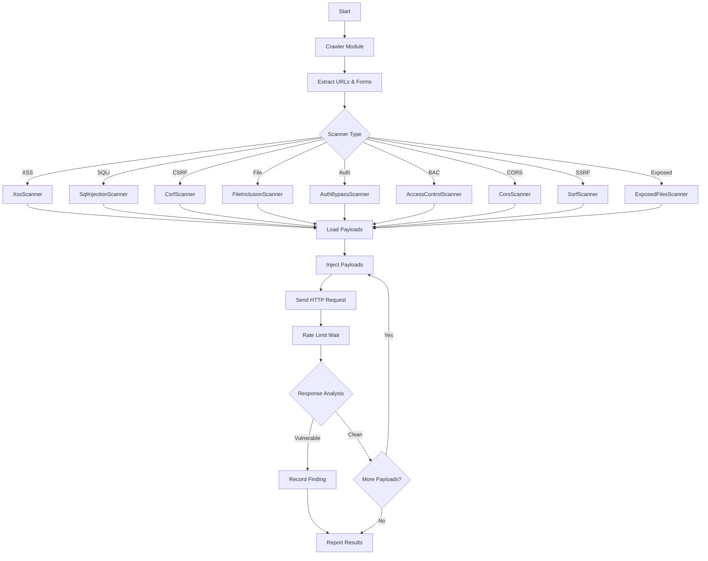
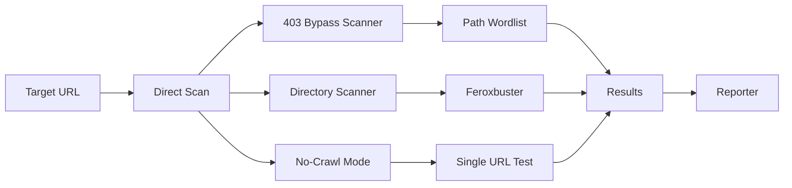
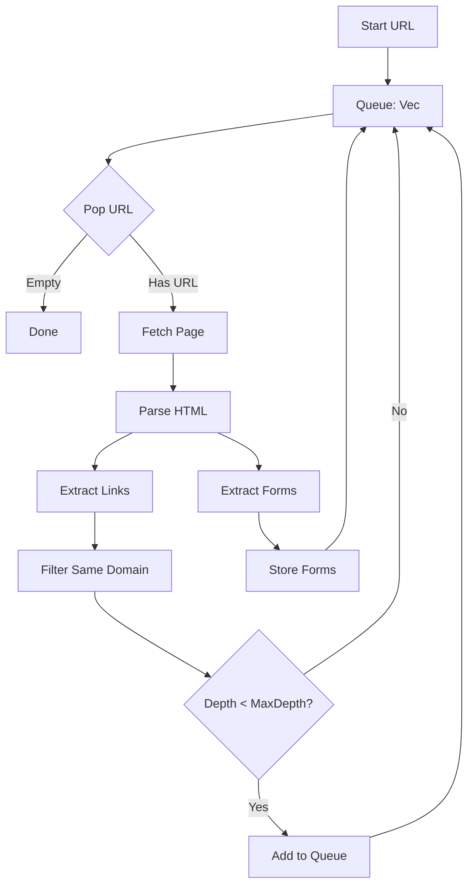
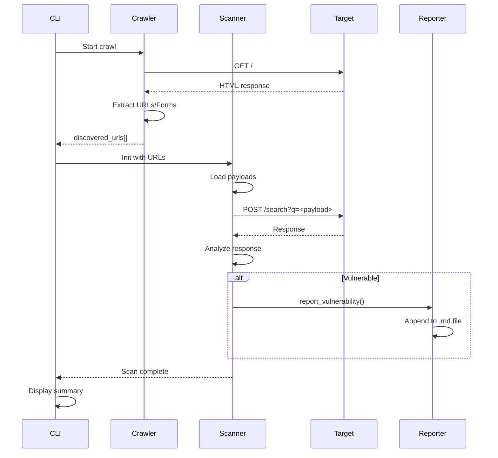
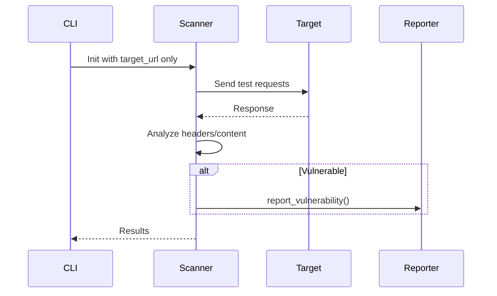
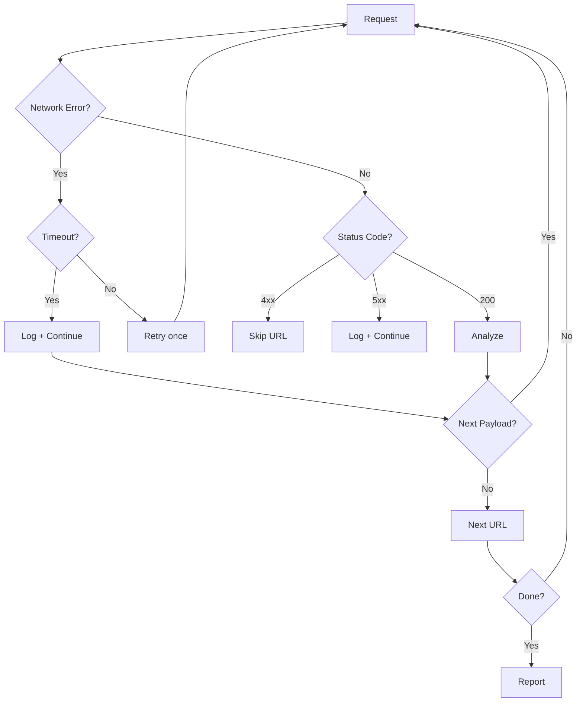

# WebHunter Architecture

## System Overview

```
┌─────────────────────────────────────────────────────────────┐
│                      WebHunter CLI                          │
│                  (Rust + Tokio + Clap)                      │
└─────────────────────┬───────────────────────────────────────┘
                      │
                      ▼
┌─────────────────────────────────────────────────────────────┐
│                   Input Processing                          │
│  ┌──────────────┐    ┌──────────────┐    ┌─────────────┐  │
│  │  CLI Args    │    │  Target URL  │    │ File Input │  │
│  │  --scanner   │    │  Validation  │    │ (--list)   │  │
│  │  --no-crawl  │    │              │    │             │  │
│  └──────────────┘    └──────────────┘    └─────────────┘  │
└─────────────────────┬───────────────────────────────────────┘
                      │
                      ▼
┌─────────────────────────────────────────────────────────────┐
│                    Rate Limiter                            │
│              (Tokio Semaphore + Config)                   │
└─────────────────────┬───────────────────────────────────────┘
                      │
          ┌───────────┴───────────┐
          ▼                       ▼
┌─────────────────────┐   ┌─────────────────────┐
│   Interactive UI    │   │  Non-Interactive    │
│   (Dialoguer)       │   │  (Direct Execution) │
└─────────┬───────────┘   └─────────┬───────────┘
          │                         │
          └───────────┬─────────────┘
                      ▼
┌─────────────────────────────────────────────────────────────┐
│                   Scanner Pipeline                          │
└─────────────────────┬───────────────────────────────────────┘
                      │
          ┌───────────┼───────────┐
          ▼           ▼           ▼
    ┌─────────┐ ┌─────────┐ ┌──────────┐
    │ Crawler │ │ Directory│ │  Direct   │
    │         │ │ Scanner  │ │  Target   │
    └────┬────┘ └────┬────┘ └─────┬────┘
         │           │            │
         ▼           ▼            ▼
    ┌────────────────────────────────────────┐
    │         Scanner Modules                │
    └────────────────────────────────────────┘
```

## Scanner Architecture

### Crawler-Based Scanners



### Non-Crawler Scanners



## Core Modules

### 1. Crawler (`crawler.rs`)



### 2. Rate Limiter (`rate_limiter.rs`)

```
┌────────────────────────────────────┐
│         Rate Limiter              │
├────────────────────────────────────┤
│  Config:                          │
│  - requests_per_second: u32        │
│  - max_concurrent: usize          │
├────────────────────────────────────┤
│  Mechanism:                       │
│  - Tokio Semaphore                │
│  - Token Bucket Algorithm          │
│  - Per-request delay              │
└────────────────────────────────────┘
```

### 3. Scanners

#### XSS Scanner

```
Input: URLs + Forms
    │
    ▼
┌─────────────────────────────────┐
│ Payload Categories:              │
│ - Event Handlers (onerror,      │
│   onload, onmouseover...)       │
│ - Script Contexts (script,      │
│   svg, div...)                   │
│ - Polyglots                      │
└─────────────────────────────────┘
    │
    ▼
┌─────────────────────────────────┐
│ Detection:                       │
│ - Reflection analysis             │
│ - HTML parsing                   │
│ - DOM analysis                   │
└─────────────────────────────────┘
```

#### SSRF Scanner

```
Input: URLs with Parameters
    │
    ▼
┌─────────────────────────────────┐
│ Payload Types:                   │
│ - Localhost (127.0.0.1,         │
│   localhost, 0.0.0.0, ::1)       │
│ - Cloud Metadata (169.254.169.254)│
│ - Internal IPs (10.x.x.x,       │
│   192.168.x.x)                  │
│ - Protocols (file://, gopher://) │
└─────────────────────────────────┘
    │
    ▼
┌─────────────────────────────────┐
│ Detection:                       │
│ - Internal content in response   │
│ - Cloud metadata detection      │
│ - OOB callbacks                 │
└─────────────────────────────────┘
```

#### CORS Scanner

```
Input: Discovered URLs
    │
    ▼
┌─────────────────────────────────┐
│ Test Origins:                   │
│ - https://evil.com              │
│ - null                          │
│ - https://target.com.evil.com   │
│ - http://192.168.1.1           │
└─────────────────────────────────┘
    │
    ▼
┌─────────────────────────────────┐
│ Analyze Headers:                │
│ - Access-Control-Allow-Origin   │
│ - Access-Control-Allow-Creds    │
│ - Access-Control-Allow-Methods  │
│ - Access-Control-Allow-Headers  │
└─────────────────────────────────┘
    │
    ▼
┌─────────────────────────────────┐
│ Findings:                       │
│ - Critical: * + true creds      │
│ - High: null origin             │
│ - High: arbitrary origin         │
│ - Medium: permissive origin     │
└─────────────────────────────────┘
```

### 4. Reporter (`reporter.rs`)

```
┌─────────────────────────────────────┐
│            Reporter                 │
├─────────────────────────────────────┤
│ Outputs:                            │
│ - XSS-output.md                    │
│ - SQL-Injection-output.md           │
│ - CSRF-output.md + HTML PoCs        │
│ - CORS-Misconfiguration-output.md   │
│ - SSRF-output.md                    │
│ - Exposed-Files-output.md           │
├─────────────────────────────────────┤
│ Format:                             │
│ - Severity badge (🔴🟠🟡)           │
│ - Finding details table              │
│ - Description + PoC                │
│ - Remediation steps                │
└─────────────────────────────────────┘
```

## Data Flow

### Standard Scan Flow



### No-Crawl Mode Flow



## Wordlist Structure

```
wordlists/
├── access_control/
│   └── sensitive_paths.txt    # /admin, /config, /api/admin
├── auth_bypass/
│   ├── default_creds.txt       # admin:admin, root:toor
│   └── sqli_login_bypass.txt   # ' OR '1'='1
├── bypass_403/
│   ├── header_payloads.txt    # X-Original-URL, X-Rewrite-URL
│   ├── methods.txt            # PUT, DELETE, PATCH
│   └── url_payloads.txt       # /%2e/, /..;/ 
├── cors/
│   └── test_origins.txt       # Origins to test
├── exposed_files/
│   ├── debug_endpoints.txt    # /debug, /env, /config
│   └── source_maps.txt        # .map file paths
├── file_inclusion/
│   ├── lfi_payloads.txt      # ../../../etc/passwd
│   └── rfi_payloads.txt      # http://evil.com/shell
├── sql_injection/
│   ├── boolean_payloads.txt   # AND 1=1
│   ├── error_payloads.txt     # AND EXTRACTVALUE
│   └── time_payloads.txt     # AND SLEEP(5)
├── ssrf/
│   └── payloads.txt           # localhost, cloud IPs
└── xss/
    └── payloads.txt           # Polyglot XSS
```

## Error Handling



## Performance Considerations

- **Async I/O**: All HTTP requests use Tokio async runtime
- **Rate Limiting**: Configurable RPS with semaphore-based throttling
- **Parallelism**: Multiple targets scanned concurrently (configurable)
- **Memory**: Efficient URL deduping with HashSet
- **Crawl Limits**: Configurable max_depth and max_urls prevent runaway crawls
